# 🤖 n8n Integration für BESS-Simulation

## 📋 **Übersicht**

Die n8n-Integration ermöglicht es, das BESS-Simulationsprogramm mit n8n-Workflows zu automatisieren und zu erweitern. Über Webhooks und REST-APIs können verschiedene BESS-Events an n8n weitergeleitet und automatisierte Workflows ausgelöst werden.

## 🚀 **Implementierte Features**

### **1. Export-Zentrum Integration**
- **Neue Karte:** "n8n Automation" im Export-Zentrum
- **Route:** `/export/n8n-automation`
- **Features:**
  - Webhook-Konfiguration
  - Workflow-Templates
  - API-Endpoint-Übersicht
  - Integration-Tests

### **2. Webhook-System**
- **Konfiguration:** `/api/n8n/webhook/config`
- **Testing:** `/api/n8n/webhook/test`
- **Trigger:** `/api/n8n/webhook/trigger`
- **Event-Typen:**
  - `simulation_complete` - BESS-Simulation abgeschlossen
  - `price_alert` - Strompreis-Alert
  - `ml_training` - ML-Modell trainiert
  - `anomaly_detected` - Anomalie erkannt

### **3. Workflow-Templates**
- **Tägliche BESS-Simulation** - Cron-basiert (06:00 Uhr)
- **Preis-Alert-System** - Webhook-basiert
- **ML-Modell-Retraining** - Wöchentlich (Montag 02:00)

### **4. API-Integration**
- **BESS-Simulation APIs:** `/api/simulation/*`
- **ML & KI APIs:** `/api/ml/*`
- **Wirtschaftlichkeitsanalyse:** `/api/enhanced-economic-analysis/*`

## 🔧 **Technische Details**

### **Webhook-Payload-Struktur**
```json
{
  "event_type": "simulation_complete",
  "timestamp": "2025-01-15T10:30:00Z",
  "source": "bess-simulation",
  "data": {
    "project_id": 1,
    "simulation_id": "sim_123",
    "results": {
      "total_revenue": 125000,
      "roi": 8.5,
      "payback_period": 12.3
    }
  }
}
```

### **n8n Workflow-Struktur**
```json
{
  "name": "BESS Daily Simulation",
  "nodes": [
    {
      "id": "1",
      "name": "Cron Trigger",
      "type": "n8n-nodes-base.cron",
      "parameters": {
        "rule": {
          "interval": [{"field": "cronExpression", "expression": "0 6 * * *"}]
        }
      }
    },
    {
      "id": "2",
      "name": "BESS Simulation",
      "type": "n8n-nodes-base.httpRequest",
      "parameters": {
        "url": "http://localhost:5000/api/simulation/run",
        "method": "POST",
        "body": {
          "project_id": 1,
          "dispatch_mode": "arbitrage"
        }
      }
    }
  ],
  "connections": {
    "1": {
      "main": [[{"node": "2", "type": "main", "index": 0}]]
    }
  }
}
```

## 📁 **Implementierte Dateien**

### **Backend**
- `app/export_routes.py` - n8n-spezifische Routes erweitert
- `app/routes.py` - Webhook-Trigger hinzugefügt

### **Frontend**
- `app/templates/export/export_center.html` - n8n-Karte hinzugefügt
- `app/templates/export/n8n_automation.html` - Neue n8n-Konfigurationsseite

### **Dokumentation**
- `N8N_INTEGRATION_DOKUMENTATION.md` - Diese Dokumentation

## 🎯 **Verwendung**

### **1. Webhook konfigurieren**
1. Gehen Sie zu `/export/n8n-automation`
2. Geben Sie Ihre n8n Webhook-URL ein
3. Wählen Sie die gewünschten Event-Typen
4. Speichern Sie die Konfiguration

### **2. Workflow-Templates laden**
1. Klicken Sie auf "Template laden" bei gewünschtem Workflow
2. Importieren Sie das JSON in n8n
3. Passen Sie die Parameter an Ihre Umgebung an

### **3. Integration testen**
1. Verwenden Sie die Test-Buttons auf der n8n-Seite
2. Überprüfen Sie die Logs in n8n
3. Stellen Sie sicher, dass die Webhooks ankommen

## 🔗 **API-Endpoints**

### **n8n-spezifische Endpoints**
```bash
# Webhook-Konfiguration
POST /api/n8n/webhook/config
GET  /api/n8n/webhook/test

# Workflow-Templates
GET  /api/n8n/workflow/templates
GET  /api/n8n/template/<template_name>

# Webhook-Trigger (intern)
POST /api/n8n/webhook/trigger
```

### **BESS-APIs für n8n**
```bash
# Simulation
POST /api/simulation/run
GET  /api/simulation/history
POST /api/simulation/10-year-analysis

# ML & KI
GET  /api/ml/status
POST /api/ml/predict/price
POST /api/ml/predict/load
GET  /api/ml/optimization/seasonal

# Wirtschaftlichkeitsanalyse
GET  /api/enhanced-economic-analysis/<project_id>
POST /api/residual-load/calculate
```

## 🚀 **Beispiel-Workflows**

### **1. Tägliche BESS-Simulation**


### **2. Preis-Alert-System**

```mermaid
graph LR
    A[Webhook Preis-Alert] --> B{Preis > 100 €/MWh?}
    B -->|Ja| C[Slack-Alert senden]
    B -->|Ja| D[BESS-Ladung starten]
    B -->|Nein| E[Log speichern]
```


### **3. ML-Modell-Retraining**


## 🔒 **Sicherheit**

### **Webhook-Sicherheit**
- API-Schlüssel für Authentifizierung
- HTTPS für sichere Übertragung
- Event-Validierung
- Rate-Limiting

### **n8n-Sicherheit**
- Webhook-Pfad-Authentifizierung
- IP-Whitelisting (optional)
- Payload-Validierung
- Logging aller Events

## 📊 **Monitoring & Logging**

### **BESS-System Logs**
```bash
# Webhook-Events
🔗 n8n Webhook Event: simulation_complete
📊 Event Data: {'project_id': 1, 'results': {...}}
📤 Würde an n8n senden: http://localhost:5678/webhook/bess-events
```

### **n8n Workflow Logs**
- Execution History
- Error Tracking
- Performance Metrics
- Success/Failure Rates

## 🎉 **Fazit**

Die n8n-Integration ist **vollständig implementiert** und bietet:

- ✅ **Webhook-System** für Event-basierte Automatisierung
- ✅ **Workflow-Templates** für häufige Use Cases
- ✅ **API-Integration** mit allen BESS-Services
- ✅ **Test-Funktionen** für einfache Validierung
- ✅ **Dokumentation** für einfache Einrichtung

**Das BESS-System ist jetzt bereit für n8n-Automation!** 🚀

---

*Letzte Aktualisierung: 15. Januar 2025 - n8n-Integration vollständig implementiert*
